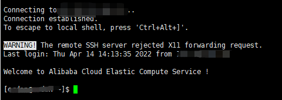

# centos7部署node项目

## 背景
最近在学习慕课网的《web前端架构师》课程，后端服务基本写完了，面临一个部署到线上的问题，那么直接采取最传统的方式，在服务器上安装项目所需要的几个东西：

- git
- node.js
- mongodb
- redis

我自己的服务器上本来是有这么几个东西的，但是阿里云服务器给我报警说我的服务器存在挖矿行为，给我停机了，然后申请解封以后就想着重新装系统，这次设置个复杂点的密码，然后看看是不是还会被挖矿程序盯上。就有了这样的一次经历，写下来是为了下次安装的时候直接复制命令，遇到问题的时候直接来这里找答案。

## 开始

等待阿里云那边重装好系统以后，通过远程工具进行连接，我这里用的是xshell，也是一个老牌的工具啦，直接百度下载就能用。然后通过账户名和密码进行登录。当看到如下截图的时候就已经登录成功啦！


登录成功以后，一般来说就要直接开始安装啦，但是这次我想多费点劲，那就是新建一个用户账号进行登录，把root禁用掉，这么做的原因是：

- 有非常多的 bot 会尝试使用 root + pwd 的 ssh 方式暴力登录机器，当尝试成功以后，黑客就会控制整个系统。

- 假如使用 特定用户名 + pwd，bot 需要先猜测用户名（N次），然后是密码（M次），这样复杂度提升到 N * M

- root 可以造成更大的危害，影响整个系统，而某个特定用户只能影响它的文件系统

**创建新用户**

```shell
# 添加用户
adduser guoerdan
# 设置密码
passwd guoerdan
# 然后会弹出提示，要你输入密码
# 密码要设置够复杂，要不会被系统拒绝，建议10字以上
```
**接下来设置该用户拥有 sudo 权限，给予它在登录以后切换到 root 的能力**

```shell
# 修改权限 u 表示所有者 w表示写权限 + 表示添加
chomd u+w /etc/sudoers
# 编辑文件
vim /etc/sudoers
# 找到 root ALL=(ALL) ALL
# 再加一行 root ALL=(ALL) ALL
```

当我们新建好一个用户以后，我们可以使用它来远程连接我们的云服务器，测试一下好不好使。也可以使用 `su`直接切换为root用户。

**禁止使用root进行远程登录**

既然我们的新用户已经可以远程连接我们的云服务器了，那么为了避免风险，就禁止root远程登录我们的云服务器。

```shell
# 修改 ssh 配置
vim /etc/ssh/sshd_config
# 修改 yes 为 no
PermitRootLogin no
# 重启 sshd 服务
service sshd restart
```

**安装nodejs**

前面我们做完了以后就可以开始安装我们需要的软件了，第一个先来装nodejs，这里呢有两种安装方式：
- 安装 nvm 管理 node 版本 地址：[https://github.com/nvm-sh/nvm](https://github.com/nvm-sh/nvm)
- 使用包管理器安装 node 最新版本
- [https://github.com/nodesource/distributions/blob/master/README.md#deb](https://github.com/nodesource/distributions/blob/master/README.md#deb)

```shell
# Using Ubuntu
curl -fsSL https://deb.nodesource.com/setup_16.x | sudo -E bash -
sudo apt-get install -y nodejs
# 添加包管理器的软件源（PPA）
# /etc/apt/sources.list
# /etc/apt/sources.list.d/
# Centos As root
curl -fsSL https://rpm.nodesource.com/setup_16.x | bash -
sudo yum install nodejs
# 查看 centos 所有的软件源
yum repolist all
```
第二种方式看起来比较简单，但是我这里选的是第一种，也就是nvm的方式。nvm的好处我就不多说了，我是因为有时候需要切换node版本所以选择的第一种方式，如果你没这个需求，直接第二种方式就好啦。

因为nvm的官方源比较慢，所以我是从gitee上面下载的

```shell
git clone https://gitee.com/abeir/nvm.git
command -v nvm
echo "source ~/nvm/nvm.sh" >> ~/.bashrc  # 这里要注意路径的问题(我就在这里踩坑了)
source ~/.bashrc
# 安装我们需要的nodejs版本
nvm install 16.14.2
# 安装最新的npm
npm install -g npm@8.6.0
# 设置淘宝源
npm config set registry https://registry.npm.taobao.org
# 下载cnpm
npm install -g cnpm --registry=https://registry.npm.taobao.org
```

**安装mongodb**

我们项目中所用到的数据库是mongodb，那么关于它在centos7的安装方式这里呢我也放两种：

- 从源代码下载安装（地址在下面）

- [https://www.mongodb.com/docs/manual/tutorial/install-mongodb-on-red-hat-tarball/](https://www.mongodb.com/docs/manual/tutorial/install-mongodb-on-red-hat-tarball/)

- 使用包管理器安装(地址在下面)

- [https://docs.mongodb.com/manual/tutorial/install-mongodb-on-red-hat/](https://docs.mongodb.com/manual/tutorial/install-mongodb-on-red-hat/)

我这里选择的是第二种方式，这个文档写的也很详细（英语不好的直接右键翻译成中文也能看懂），使用yum来安装mongodb

手动创建一个源 以便后续可以直接使用yum来安装mongodb
```shell
[mongodb-org-5.0]
name=MongoDB Repository
baseurl=https://repo.mongodb.org/yum/redhat/$releasever/mongodb-org/5.0/x86_64/
gpgcheck=1
enabled=1
gpgkey=https://www.mongodb.org/static/pgp/server-5.0.asc

```

```shell
#在执行下面这句话之前可能会报错，我们需要手动创建一个mongodb-org源(见上面)
sudo yum install -y mongodb-org
# 安装特定版本的话下面这样写
sudo yum install -y mongodb-org-5.0.7 mongodb-org-database-5.0.7 mongodb-org-server-5.0.7 mongodb-org-shell-5.0.7 mongodb-org-mongos-5.0.7 mongodb-org-tools-5.0.7
```

默认情况下，MongoDB 使用mongod用户帐户运行并使用以下默认目录：

- `/var/lib/mongo`(数据目录)
  
- `/var/log/mongodb`(日志目录)

其实完成上面两步以后就可以启动我们的mongodb服务啦，那么我们来看一下启动服务的命令：

```shell
# 启动mongodb服务
sudo systemctl start mongod
# 查看服务状态
sudo systemctl status mongod
# 停止mongodb
sudo systemctl stop mongod
# 重启mongdob
sudo systemctl restart mongod
```

开始使用mongodb:

```shell
mongosh
```

这个时候其实我们能够在服务器上跑起来mongodb啦，也能使用命令行来操作它了，但是这个时候我打开我平时最常用的可视化工具robo 3T 发现我竟然远程连接不上它！原因是因为要修改mongodb的配置文件，将ip地址改为0.0.0.0(默认是127.0.0.1)

```shell
sudo vim /etc/mongod.conf

# 查找到 bindIP 然后改为0.0.0.0
```

**不要忘了重启mongodb服务！！！**
```shell
sudo systemctl restart mongod
```

改完配置以后重启我们的mongodb服务，接着使用我们的robo3T就可以远程链接上我们的mongodb数据库啦~

**安装redis**

最后我们来安装redis，它呢也是有两种安装方式：

- 从源代码下载安装

- 使用包管理器安装（地址在下面）

- [https://www.digitalocean.com/community/tutorials/how-to-install-secure-redis-centos-7](https://www.digitalocean.com/community/tutorials/how-to-install-secure-redis-centos-7)

```shell
# 安装redis之前先安装一下EPEL
sudo yum install epel-release
# EPEL 安装完成后，您可以再次使用以下命令安装 Redis yum
sudo yum install redis -y
# 这可能需要几分钟才能完成。安装完成后，启动Redis服务
sudo systemctl start redis.service
# 如果您希望 Redis 在启动时启动，可以使用以下enable命令启用它：
sudo systemctl enable redis
# 您可以通过运行以下命令检查 Redis 的状态：
sudo systemctl status redis.service
# 确认 Redis 确实在运行后，使用以下命令测试设置：
redis-cli ping
```

至此，我们项目想要在服务器上跑起来所需要的几个东西就都安装好啦~

希望能够帮到你~
