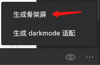

# 微信小程序基础用法

## wxs的应用

#### 处理文本转换

```js
var convert = function (status) {
  var statusText;

  switch (status) {
    case 0:
      statusText = '待审核'
      break;
    case 1:
      statusText = '待发布'
      break;
    case 2:
      statusText = '已发布'
      break;
      case 3:
      statusText = '已下架'
      break;
      case 4:
      statusText = '已取消'
      break;
      case 5:
      statusText = '审核不通过'
      break;
    default:
      statusText = '未知状态'
  }
  return statusText
}

module.exports = {
  convert: convert
}
```

```wxml
<wxs src="/common/wxs/status-text.wxs" module="statusText"></wxs>
<view>{{statusText.convert(service.status)}}</view>
```

#### wxs实现手指滑动监听切换标签
```js
var touchStartX
function handleTouchstart(event) {
    touchStartX = event.changedTouches[0].clientX
}

function handleTouchend(event, ownerInstance) {
    var touchEndX = event.changedTouches[0].clientX
    // 负数代表手指向左滑动了 正数代表向右滑动了
    var distance = touchEndX - touchStartX
    // -1 后退 0 不动  1 前进
    var direction = 0
    // 向左滑动 前进
    if (distance < 0 && distance <-70) {
        direction = 1
    }
    // 向右滑动 后退
    if (distance > 0 && distance > 70) {
        direction = -1
    }

    if (direction !== 0) {
        // 1.触发事件
        ownerInstance.callMethod('handleTouchMove', {direction: direction})
    }
}

module.exports = {
    handleTouchstart: handleTouchstart,
    handleTouchend: handleTouchend
}
```

```wxml
<wxs src="../../common/wxs/touchMove.wxs" module="touch"></wxs>
 <view class="tab-panel" 
    bind:touchstart="{{touch.handleTouchstart}}" 
    bind:touchend="{{touch.handleTouchend}}">
   <slot name="panel"></slot>
 </view>
```

## behavior
```js
const behavior = Behavior({
    properties: {
        service: Object
    }
})

export default behavior


import behavior from "../behavior/behavior";
Component({
behaviors: [behavior]
})
```

关于微信小程序的behavior，我觉得就和vue框架的mixin混入是一样的，他可以抽离一些不同组件共有的逻辑，然后引入到组件中使用。

#### 路由传参与骨架屏

```js
// 选中某一服务
  handleSelectService(event) {
    const service = event.currentTarget.dataset.service
    // 思考 如何传递给详情页
    // 1.缓存 会存在数据不一致的问题  在广场页面点击了以后，详情页面拿到的数据都来自于缓存，当服务发布者改动了信息以后，它是感知不到的，可能会影响后面的流程
    // 2.只传递一个id,详情页根据id向后端发起请求 获取数据，思考，如何传递数据？
    wx.navigateTo({
      url: '/pages/service-detail/service-detail?service_id=' + service.id,
    })
  }

 onLoad: async function (options) {
    // 在页面的onLoad钩子函数中拿到我们上一个页面传递过来的参数 
    this.data.id = options.service_id
  }

```

#### 骨架屏
微信小程序开发者工具可以帮我们快速的生成骨架屏，如下图：



这个位置是在微信开发者工具的模拟器下面的三个点打开的，当我们点击"生成骨架屏"以后，会帮我们在页面上添加wxml文件和wxss文件，我们将这两个文件放到我们的页面当中去就好
其中要注意的是，wx:if 他们写错了，我们要手动改一下，这可能是微信方面一个小细节的失误。

#### 异常捕获
有时候我们需要较为详细的报错信息，但是微信小程序并没有给我们提供这种天然的报错机制，所以我们这里要用到js原生的try...catch来捕获异常，我们需要自己封装一下，那么我们在哪里进行捕获要视情况而定，比如我们想捕获到请求相关的错误，那么我们就要在自己封装的http类当中去进行捕获。 

```js
class Http {
    static async request({url,data,method = 'GET', refresh = true}) {
        let res
        try {
            res =  await wxToPromise('request', {
                url: APIConfig.baseUrl + url,
                data,
                method,
                header: {
                    token: wx.getStorageSync(cache.TOKEN)
                }
            })
        }catch (e) {
            Http._showError(-1)
            throw new Error(e.errMsg)
        }
        if (res.statusCode < 400) {
            return res.data.data
        }
        if (res.statusCode === 401) {
            // TODO 令牌操作
            if (res.data.error_code === 10001) {
                wx.navigateTo({
                    url: '/pages/login/login'
                })
                throw Error('请求未携带令牌')
            }
            if (refresh) {
                return await Http._refresh({url, data, method, refresh})
            }
        }

        Http._showError(res.data.error_code, res.data.message)
        const error = Http._generateMessage(res.data.message)
        throw Error(error)
    }

    static _showError(errorCode, message) {
        let title = ''
        const errorMessage = exceptionMessage[errorCode]
        title = errorMessage || message || '未知异常'
        title = Http._generateMessage(title)
        wx.showToast({
            title,
            icon: 'none',
            duration: 3000,
        })
    }

    static _generateMessage(title) {
        return typeof title === 'object' ? Object.values(title).join(';') : title
    }
    
}
```
如上面代码所示，我们对http请求返回的响应做了判断，我们提供了一个枚举对象，里面写了我们定义好的错误信息及状态码，首先会去枚举对象中查找错误，如果没有的话，就返回接口给我们的message,如果后端也没有返回给我们message，那就返回我们自己定义的"未知异常"。

## 登录机制与令牌刷新

```js
handleLogin: async function () {
        const res = await wx.getUserProfile({
            desc: '完善用户信息'
        })
        wx.showLoading({
            title: '正在授权',
            mask: true
        })
        try {
            await User.login()
            await User.updateUserInfo(res.userInfo)
            const events = this.getOpenerEventChannel()
            events.emit('login')
            wx.navigateBack()
        } catch (e) {
            wx.showModal({
                title: '注意',
                content: '登录失败，请稍后重试',
                cancelText: false
            })
            console.log(e)
        }
        wx.hideLoading()
    }
```

上面这段逻辑呢是我们登录页面点击登录以后的逻辑代码，我们会调用微信小程序原生的api，如果用户同意我们就会获取到用户的一些基本信息（昵称，头像，性别），我们接下来调用User这个模型类，进行登录和更新用户信息的操作。 

这里要注意的是我们还用到了微信小程序提供的事件通信机制，因为我们在登录成功以后，还要在服务详情页面进行一次判断，判断用户的角色是不是发布者，所以我们在这里利用事件通信机制是很巧妙的。

只要涉及到登录，那么就会有一个登录过期的情况，如果登录过期了，我们应该如何做呢？那就是让用户再次登录 刷新令牌。 那么这个时候我们应该思考，在什么时间进行令牌刷新？判断的条件又是什么呢？

我们和后端商定好了 如果返回的状态码是401，那么就是token出现了错误，又判断error_code如果是10001 那么就是没有携带token,除了这种情况呢，就是我们说的令牌失效的情况，所以我们在这个时候来进行令牌的刷新行为。
可以很快的想到，这个事情是要在Http这个模型类当中去做的。

```js
if (res.statusCode === 401) {
            // TODO 令牌操作
            if (res.data.error_code === 10001) {
                wx.navigateTo({
                    url: '/pages/login/login'
                })
                throw Error('请求未携带令牌')
            }
            if (refresh) {
                return await Http._refresh({url, data, method, refresh})
            }
        }

  static async _refresh(data) {
        await User.login()
        data.refresh = false
        await Http.request(data)
    }
```