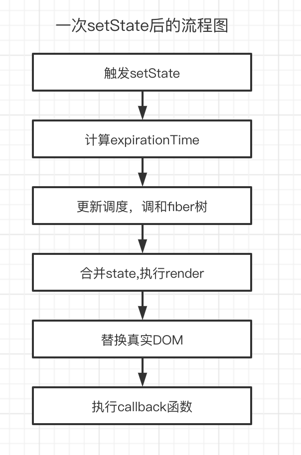

# 玄学state

## 类组件中的state

### setState用法
React项目中UI的改变来源于state改变，类组件中```setState```是更新组件，渲染视图的主要方式。

### 基本用法

```javascript
setState(obj, callback)
```
- 第一个参数：当obj为一个对象时，则为即将合并的state；如果obj是一个函数，那么当前组件的state和props将作为参数，返回值用于合并新的state。

- 第二个参数callback： callback为一个函数，函数执行上下文中可以获取当前setState更新后的最新state值，可以作为依赖state变化的副作用函数，可以用来做一些基于DOM的操作。

```javascript
/* 第一个参数为function类型 */
this.setState((state, props) => {
    return { number: 1 }
})

/* 第一个参数为object类型 */
this.setState({number: 1}, () => {
    console.log(this.state.number)
})
```

假如在一次事件中触发了一次如上setState，在React底层主要做了哪些事呢？

- 首先，setState会产生当前更新的优先级（老版本用expirationTime, 新版本用lane）
- 接下来，React会从fiber Root根部 fiber 向下调和子节点，调和阶段将对比发生更新的地方，更新对比expirationTime,找到发生更新的组件，合并state,然后触发render函数，得到新的UI视图层，完成render阶段。
- 接下来到commit阶段，commit阶段，替换真实DOM,完成此次更新流程。

- 此时仍然在commit阶段，会执行setState中的callback函数，如上的      
```（）=> {console.log(this.state.number)}```函数体内容，到此为止完成了一次setState全过程。

**更新的流程图如下**



**要记住的任务先后顺序：** render阶段 render函数执行 -> commit阶段 替换真实DOM -> setState 回调函数执行 callback

**类组件如何限制state更新视图**

- pureComponent可以对state和props进行浅比较，如果没有发生变化，那么组件不更新。

- shouldComponentUpdate生命周期可以通过判断前后state变化来决定组件需不需要更新，需要更新饭绘true,否则返回false。


## 函数组件中的state

### useState用法

**基本用法**

```javascript
[state, dispatch] = useState(initData)
```

- state,目的提供给UI，作为渲染视图的数据源。
- dispatch 改变state的函数，可以理解为推动函数组件渲染的渲染函数。
- initData有两种情况，第一种是非函数，将作为state初始化的值。第二种情况是函数，返回值作为useState初始化的值。

initData为非函数的情况：

```javascript
const [number, setNumber] = React.useState(0)
```

initData为函数的情况：

```javascript
const [number, setNumber] = React.useState(() => {
    if(props.a === 1) return Math.random()
    if(props.a === 2) return Math.ceil(Math.random() * 10)
    return Math.ceil(Math.random() * 100)
})
```

对于dispatch的参数也有两种情况：

- 第一种非函数情况，此时将作为新的值，赋予state,作为下一次渲染使用。

- 第二种函数情况，如果dispatch的参数是一个函数，这里可以称它为reducer, reducer的参数，是上一次返回最新的state, 返回值作为新的state。

**dispatch参数是一个非函数**

```javascript
cosnt [number, setNumber] = React.useState(0)
const handleClick = () => {
    setNumber(1)  // state ->  1
    setNumber(2)  // state ->  2
    setNumber(3)  // state ->  3
}
```

**dispatch参数是一个函数**

```javascript
cosnt [number, setNumber] = React.useState(0)
const handleClick = () => {
    setNumber((prevState) => prevState + 1)  // state ->  0 + 1 = 1
    setNumber(10)  // state ->  10
    setNumber((prevState) => prevState + 1) // state-> 10 + 1 == 11
}
```

### 如何监听state变化？
在类组件setState中，可以通过第二个参数callback或者是生命周期componentDidUpdate检测监听到state改变或是组件更新。

那么在函数组件中，如何监听state变化呢？这个时候就需要```useEffect```出场了，通常可以把state作为依赖项传入useEffect第二个参数deps,但是注意useEffect初始化会默认执行一次。

```javascript
export default function Index(props) {
    const [ number, setNumber ] = useState(0)

    useEffect(() => {
        console.log('监听number变化，此时的number是: ' + number)
    }, [number])

    const handleClick = () => {
        ReactDOM.flushSync(() => {
            setNumber(2)
        })
        setNumber(1)
        setTimeout(() => {
            setNumber(3)
        })
    }

    console.log(number)

    return <div>
        <span>{ number }</span>
        <button onClick = {handleClick}>click me</button>
    </div>
}
```

**dispatch更新特点**

useState有一点值得注意的是：当调用改变state的函数dispatch，在本次函数执行上下文中，是获取不到最新的state值的。

```javascript
const [ number, setNumber ] = useState(0)
 const handleClick = () => {
        ReactDOM.flushSync(() => {
            setNumber(2)
            console.log(number)
        })
        setNumber(1)
        console.log(number)
        setTimeout(() => {
            setNumber(3)
            console.log(number)
        })
    }

```

原因很简单，函数组件更新就是函数的执行，在函数一次执行过程中，函数内部所有变量重新声明，所以改变的state，只有在下一次函数组件执行时才会被更新，所以如上同一个函数执行上下文中，number一直为0，无论怎么打印，都拿不到最新的state。

**useState注意事项**

在使用useState的dispatchAction更新state的时候，记得不要传入相同的state,这样会使视图不更新。比如下面这么写：

```javascript
export default function Index() {
    const [state, dispatchState] = useState({ name: "guozhaoxi" })
    const handleClick = () => {  // 点击按钮，视图没有更新
        state.name = "guoerdan"
        dispatchState(state)   // 直接改变state,在内存中指向的地址相同
    }
    return <div>
        <span>{ state.name }</span>
        <button onClick={handleClick}>changeName</button>
    </div>
}
```

在useState的dispatchState处理逻辑中，会浅比较两次state,发现state相同，不会开启更新调度任务；demo中两次state指向了相同的内存空间，所以默认state相等，就不会发生视图更新了。

解决上述问题：将dispatchState改为dispatchState({...state})根本解决了问题，浅拷贝了对象，重新申请了一个新的内存空间。

### useState原理揭秘

类组件中的```setState```和函数组件中的```useState```有什么异同？

相同点： 首先从原理角度出发， setState和useState更新视图，底层都调用了scheduleUpdateOnFiber方法，而且事件驱动情况下都有批量更新规则。

**不同点**

- 在不是pureComponent组件模式下，setState不会浅比较两次state的值，只要调用setState，在没有其他优化手段的前提下，就会执行更新，但是useState中的dispatchAction会默认比较两次state是否相同，然后决定是否更新组件。

- setState有专门监听state变化的回调函数callback，可以获取最新state; 但是在函数组件中，只能通过useEffect来执行state变化引起的副作用。

- setState在底层逻辑上主要是和老state进行合并处理，而useState更倾向于重新赋值。